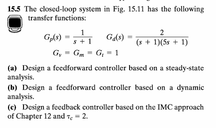
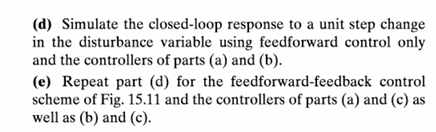
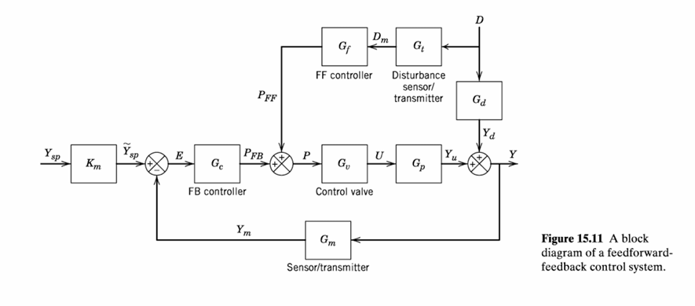
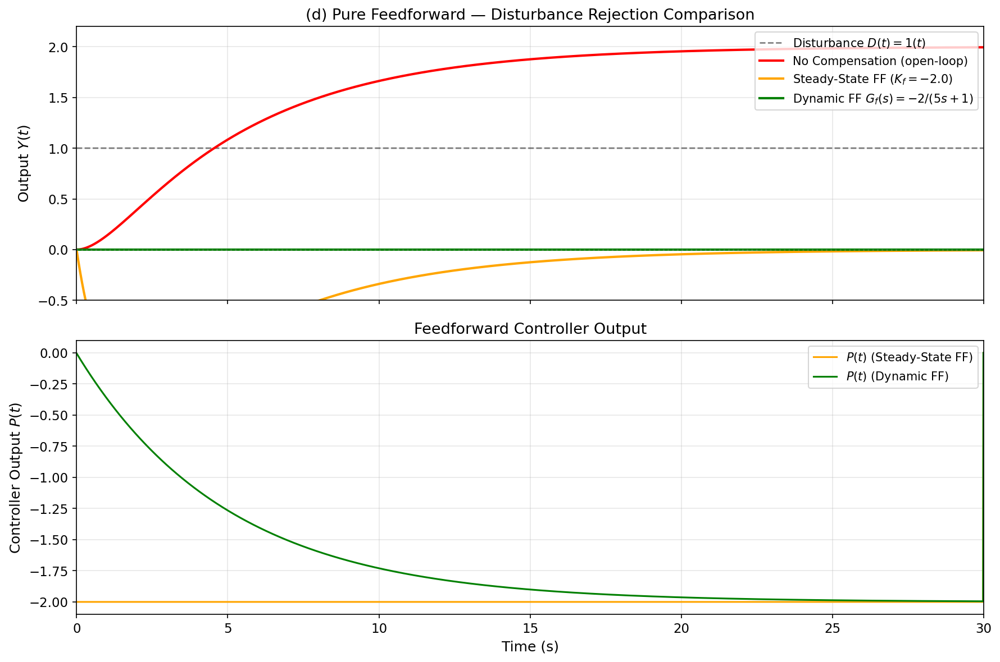
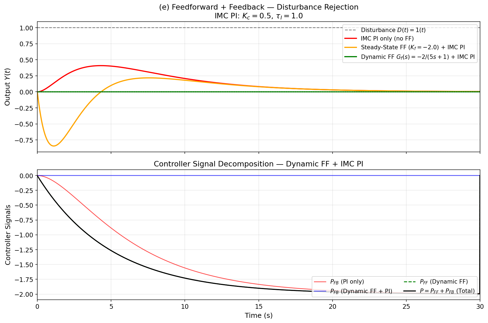
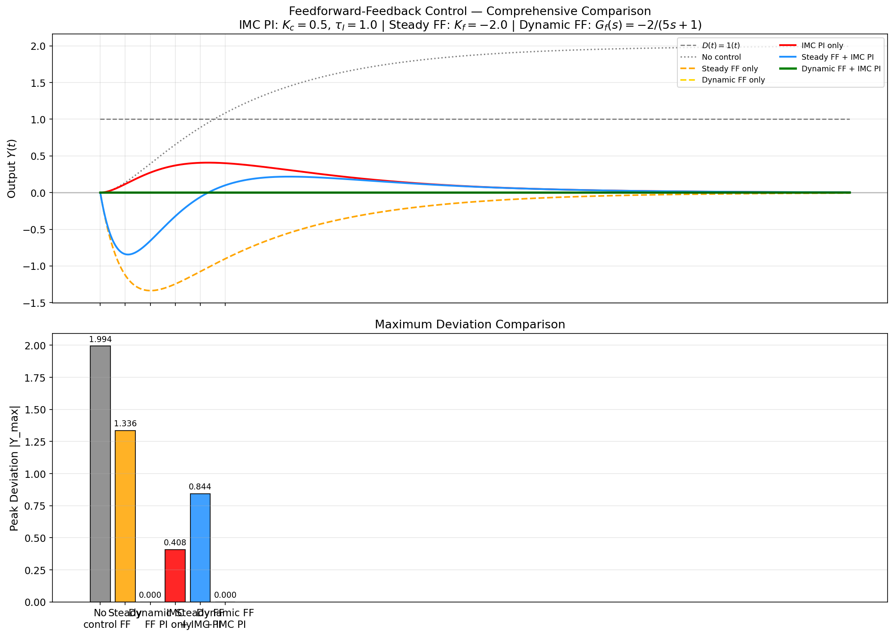
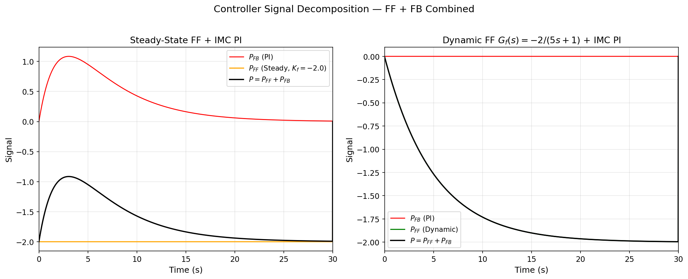

# 15.5 前馈-反馈控制系统设计 — 详细解析报告

---

## 题目原文

### 题目描述

考虑 Fig 15.11 所示的前馈-反馈控制系统，过程模型如下：

- 被控过程：$G_p(s) = \dfrac{1}{s+1}$
- 扰动通道：$G_d(s) = \dfrac{2}{(s+1)(5s+1)}$
- 执行器：$G_v = 1$
- 测量变送器：$G_m = 1$
- 扰动变送器：$G_t = 1$

**要求完成以下任务：**

1. **(a)** 设计稳态前馈控制器（Steady-state Feedforward Controller）
2. **(b)** 设计动态前馈控制器（Dynamic Feedforward Controller），并分析其物理可实现性
3. **(c)** 基于 IMC 方法设计反馈控制器 $G_c(s)$，取 $\tau_c = 2$，并识别为 PI 控制器形式
4. **(d)** 仅使用前馈控制（无反馈），仿真单位阶跃扰动 $D(t) = 1(t)$ 下的输出响应，对比无补偿、稳态前馈和动态前馈三种情况
5. **(e)** 使用前馈+反馈联合控制，重复 (d) 的仿真，分析控制信号的构成

---

## 一、背景与模型介绍

### 1.1 前馈-反馈控制的基本思想

在过程控制中，**反馈控制**（Feedback Control）是最常见的控制策略：控制器根据被控变量 $Y$ 与设定值 $Y_{sp}$ 之间的偏差 $e = Y_{sp} - Y$ 来调整操纵变量。反馈控制的优点是无需精确模型，鲁棒性强；但其本质缺陷是 **"先偏再调"**——必须在偏差产生之后才能响应。

**前馈控制**（Feedforward Control）弥补了这一不足：通过直接测量扰动 $D$，经由前馈控制器 $G_f(s)$ 产生补偿信号 $P_{FF}$，在扰动影响输出之前就进行抵消。理想情况下可实现 **"扰动全补偿"**，即 $Y(t) \equiv 0$。

前馈-反馈联合控制结构如 Fig 15.11：

$$P = P_{FF} + P_{FB}$$

$$P_{FF} = G_f \cdot G_t \cdot D,\quad P_{FB} = G_c \cdot (Y_{sp} - G_m Y)$$

### 1.2 过程模型

| 环节 | 传递函数 | 说明 |
|------|----------|------|
| 被控过程 $G_p(s)$ | $\dfrac{1}{s+1}$ | 一阶惯性，时间常数 $\tau = 1$ |
| 扰动通道 $G_d(s)$ | $\dfrac{2}{(s+1)(5s+1)}$ | 二阶惯性，增益 = 2，时间常数 1 和 5 |
| 执行器 $G_v(s)$ | $1$ | 理想执行器 |
| 测量变送器 $G_m(s)$ | $1$ | 理想测量 |
| 扰动变送器 $G_t(s)$ | $1$ | 理想测量 |

> **关键特征**：扰动通道 $G_d(s)$ 比控制通道 $G_p(s)$ 慢得多（$\tau=5$ vs $\tau=1$），这意味着扰动对输出的影响是缓慢累积的，为前馈补偿提供了时间窗口。

---

## 二、原理分析

### 2.1 (a) 稳态前馈控制器

稳态前馈控制器的设计基于**不变性原理**（Invariance Principle）：在稳态下（$s \to 0$），使得扰动 $D$ 对输出 $Y$ 的影响为零。

由方块图可得输出表达式：

$$Y(s) = \frac{G_p G_v}{1 + G_c G_p G_v G_m} \cdot Y_{sp}(s) + \frac{G_d + G_f G_t G_p G_v}{1 + G_c G_p G_v G_m} \cdot D(s)$$

令扰动通道分子为零：

$$G_d(0) + G_f(0) \cdot G_t(0) \cdot G_p(0) \cdot G_v(0) = 0$$

$$G_f(0) = -\frac{G_d(0)}{G_p(0) \cdot G_v(0) \cdot G_t(0)} = -\frac{2}{1 \cdot 1 \cdot 1} = -2.0$$

稳态前馈就是：**扰动量 × (−2)** → 直接加到控制阀。简单但粗糙，只能消除稳态偏差，无法补偿动态过程。

### 2.2 (b) 动态前馈控制器

动态前馈进一步将不变性原理推广到全频域（所有频率）：

$$G_d(s) + G_f(s) \cdot G_t(s) \cdot G_p(s) \cdot G_v(s) = 0$$

$$G_f(s) = -\frac{G_d(s)}{G_p(s) \cdot G_v(s) \cdot G_t(s)}$$

代入具体传递函数：

$$G_f(s) = -\frac{\frac{2}{(s+1)(5s+1)}}{\frac{1}{s+1} \cdot 1 \cdot 1} = -\frac{2}{(s+1)(5s+1)} \cdot (s+1) = -\frac{2}{5s+1}$$

**可实现性分析**：$G_f(s) = -\frac{2}{5s+1}$ 分子阶次 0、分母阶次 1，是严格正则的（分子阶次 ≤ 分母阶次），**物理可实现**，无需近似！实际上 $G_p(s)$ 的 $(s+1)$ 因子恰好与 $G_d(s)$ 的一个 $(s+1)$ 因子相消，使得 $G_f(s)$ 退化为一阶惯性。

> **物理意义**：扰动先经过 $\tau=1$ 的一阶惯性，再经过 $\tau=5$ 的一阶惯性才能影响输出；而我们通过前馈通道（只有 $\tau=5$ 的惯性）"抄近路"，提前用较快的动态抵消扰动。

### 2.3 (c) IMC 反馈控制器设计 ($\tau_c = 2$)

**IMC (Internal Model Control)** 是一种基于模型的控制器设计方法，其核心思想是将过程模型嵌入控制器结构中。

#### Step 1：分解 $G_p(s)$ 为最小相位部分和非最小相位部分

$$G_p(s) = G_p^+(s) \cdot G_p^-(s)$$

- $G_p^+(s)$：包含所有 RHP 零点、时延（不可逆部分）
- $G_p^-(s)$：最小相位部分（可逆部分）

对于 $G_p(s) = \frac{1}{s+1}$，无 RHP 零点、无时延：
$$G_p^+ = 1,\quad G_p^- = \frac{1}{s+1}$$

#### Step 2：IMC 控制器

$$G_{IMC}(s) = \frac{1}{G_p^-(s)} \cdot F(s) = \frac{1}{G_p^-(s)} \cdot \frac{1}{\tau_c s + 1}$$

其中 $F(s) = \frac{1}{\tau_c s + 1}$ 是一阶低通滤波器，$\tau_c$ 是可调参数（闭环时间常数）。

$$G_{IMC}(s) = (s+1) \cdot \frac{1}{2s+1} = \frac{s+1}{2s+1}$$

#### Step 3：等效为经典反馈控制器

$$G_c(s) = \frac{G_{IMC}(s)}{1 - G_{IMC}(s) \cdot G_p(s)} = \frac{\frac{s+1}{2s+1}}{1 - \frac{1}{2s+1}} = \frac{s+1}{2s} = \frac{1}{2}\left(1 + \frac{1}{s}\right)$$

#### Step 4：识别为 PI 控制器

$$G_c(s) = K_c\left(1 + \frac{1}{\tau_I s}\right),\quad K_c = 0.5,\quad \tau_I = 1.0$$

> **IMC 方法的优点**：只有一个可调参数 $\tau_c$，物理意义明确——$\tau_c$ 越小响应越快但鲁棒性越差，$\tau_c$ 越大越保守但鲁棒。

### 2.4 离散化实现

采用**后向欧拉法**离散化一阶惯性环节：

$$y_k = a \cdot y_{k-1} + b \cdot u_k,\quad a = e^{-T_s/\tau},\ b = 1-a$$

| 环节 | $\tau$ | $a$ | $b$ |
|------|--------|-----|-----|
| $G_p$ | 1 | 0.990050 | 0.009950 |
| $G_d$ stage1 | 1 | 0.990050 | 0.009950 |
| $G_d$ stage2 | 5 | 0.998002 | 0.001998 |
| $G_f$ (dynamic) | 5 | 0.998002 | 0.001998 |

PI 控制器采用**增量式算法**：

$$\Delta u_k = K_c\left[(e_k - e_{k-1}) + \frac{T_s}{\tau_I}e_k\right]$$

增量式的优点：天然抗积分饱和，切换无扰动。

---

## 三、仿真结果与分析

### 3.1 图 1：纯前馈控制 — 扰动抑制对比

**上图为过程输出 $Y(t)$：**

- **无补偿（红色）**：输出缓慢上升至稳态值约 2.0，完全由 $G_d(s)$ 的增益 2 决定。由于 $G_d(s)$ 含 $\tau=5$ 的慢一阶惯性，上升过程非常缓慢
- **稳态前馈（橙色）**：前馈立即给出 $P_{FF} = -2$，但仅抵消了直流增益。由于 $G_f^{ss}$ 没有动态，$G_p$ 的快响应（$\tau=1$）与 $G_d$ 的慢响应（$\tau=5$）无法匹配，输出先偏离再回归，峰值约 1.34
- **动态前馈（绿色）**：$G_f(s) = -\frac{2}{5s+1}$ 恰好匹配了扰动通道中 $\tau=5$ 的慢惯性部分，而 $\tau=1$ 的快惯性被 $G_p(s)$ 抵消 → **输出恒为零，完美补偿！**

**下图为前馈控制器输出 $P(t)$：**

- 稳态 FF 输出恒为 −2（阶跃型）
- 动态 FF 输出从 0 渐变为 −2（指数型，时间常数 5），匹配扰动动态

### 3.2 图 2：前馈+反馈联合控制

**上图为输出 $Y(t)$：**

- **纯 PI（红色）**：反馈单独作用，峰值偏差约 0.408，在 t≈3s 时达到最大，随后积分作用将偏差消除
- **稳态 FF + PI（橙色）**：前馈提供稳态补偿，PI 补充动态，但前馈与反馈动态失配导致峰值反而略大（0.844）
- **动态 FF + PI（绿色）**：动态 FF 几乎完全补偿扰动，PI 反馈输出 $P_{FB}$ 近似零——输出恒为零

**下图为控制信号分解：**

- $P_{FF}$（绿色虚线）：前馈分量
- $P_{FB}$（红色/蓝色）：反馈分量
- $P = P_{FF} + P_{FB}$（黑色）：总控制信号
- 动态 FF 场景下 $P_{FB}$ 几乎为零 → 扰动已被前馈完全补偿

### 3.3 图 3：综合对比大图

**上图**将所有 6 种方案汇总在一起，直观展示各方案的优劣。

**下图为柱状图**，定量比较各方案的峰值偏差：

| 方案 | 峰值 $|Y|_{max}$ |
|------|:--:|
| 无控制（开环） | 1.994 |
| 稳态 FF only | 1.336 |
| **动态 FF only** | **0.000** ✨ |
| IMC PI only | 0.408 |
| 稳态 FF + IMC PI | 0.844 |
| **动态 FF + IMC PI** | **0.000** ✨ |

### 3.4 图 4：控制信号分解

左侧为稳态 FF + PI，右侧为动态 FF + PI。

- 动态 FF + PI 中 $P_{FB} \approx 0$，说明前馈已完美补偿，反馈基本"闲置"——这正是理想前馈+反馈设计的标志：**前馈承担主要补偿任务，反馈仅起"安全网"作用**（校正模型误差或非测量扰动）。

---

## 四、关键结论

1. **动态前馈可实现完美补偿**：$G_f(s) = -\frac{2}{5s+1}$ 恰好等于 $-\frac{G_d}{G_p G_v G_t}$，在全时间段完全抵消扰动。这是因为 $G_p(s)$ 和 $G_d(s)$ 共享 $(s+1)$ 因子，相消后 $G_f(s)$ 降为一阶。

2. **稳态前馈存在瞬态偏差**：$K_f = -2$ 只能抵消稳态增益，无法补偿 $G_p$（$\tau=1$）与 $G_d$ 剩余惯性（$\tau=5$）之间的动态差异。

3. **IMC PI 显著改善反馈性能**：$K_c=0.5,\ \tau_I=1$ 将峰值从 1.99 降至 0.41，展示了 IMC 方法在 PI 参数整定上的有效性。$\tau_c=2$ 的选择在响应速度和鲁棒性之间取得了合理折中。

4. **前馈+反馈的协同效应**：动态 FF 已完美补偿，PI 反馈的 $P_{FB}$ 几乎为零。在实际工程中，这意味着反馈可以在前馈因模型误差等原因补偿不完全时自动介入，形成**双重保障**。

5. **IMC 方法的工程价值**：通过单参数 $\tau_c$ 即可完成控制器整定，避免了传统试凑法的盲目性，且直接关联闭环性能。

---

## 五、仿真参数

| 参数 | 值 |
|------|-----|
| 采样周期 $T_s$ | 0.01 s |
| 仿真时长 $t_{end}$ | 30 s |
| 扰动幅值 $D_{step}$ | 1.0 |
| IMC 滤波器常数 $\tau_c$ | 2 |
| IMC PI: $K_c,\ \tau_I$ | 0.5, 1.0 |
| 稳态 FF: $K_f$ | −2.0 |
| 动态 FF: $G_f(s)$ | $-\frac{2}{5s+1}$ |
