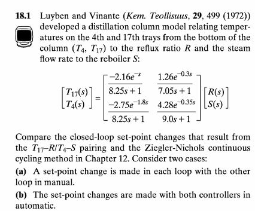
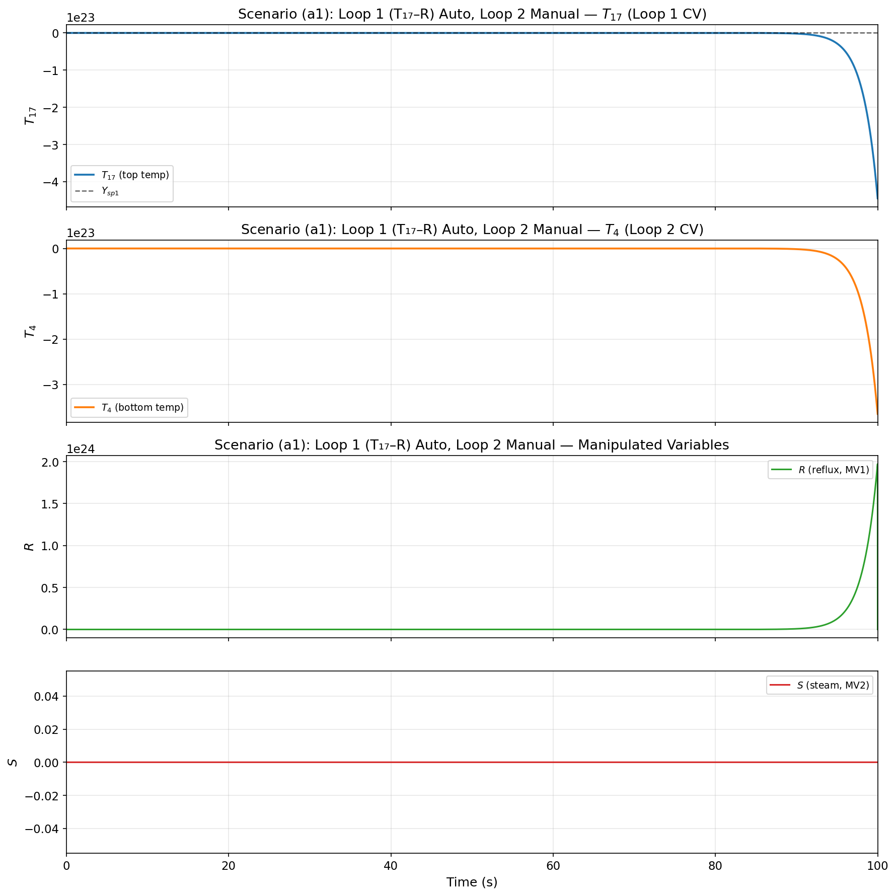
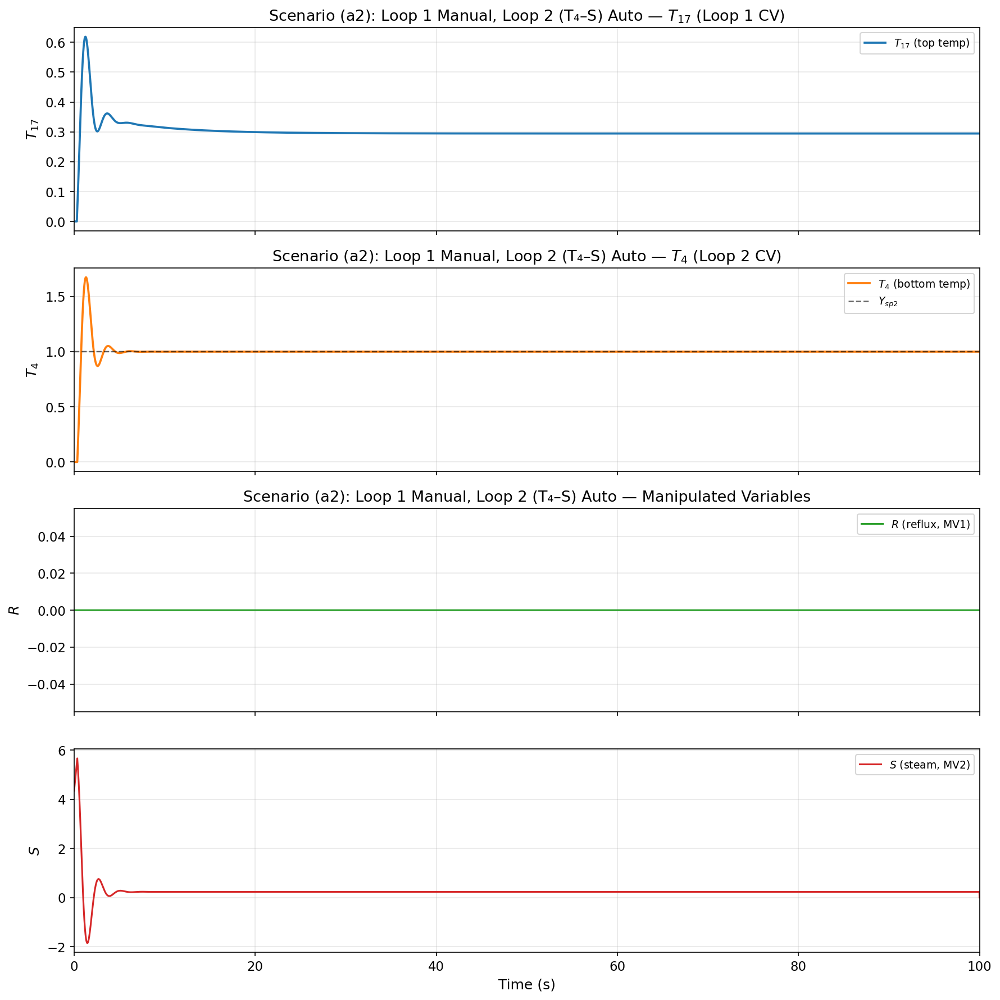
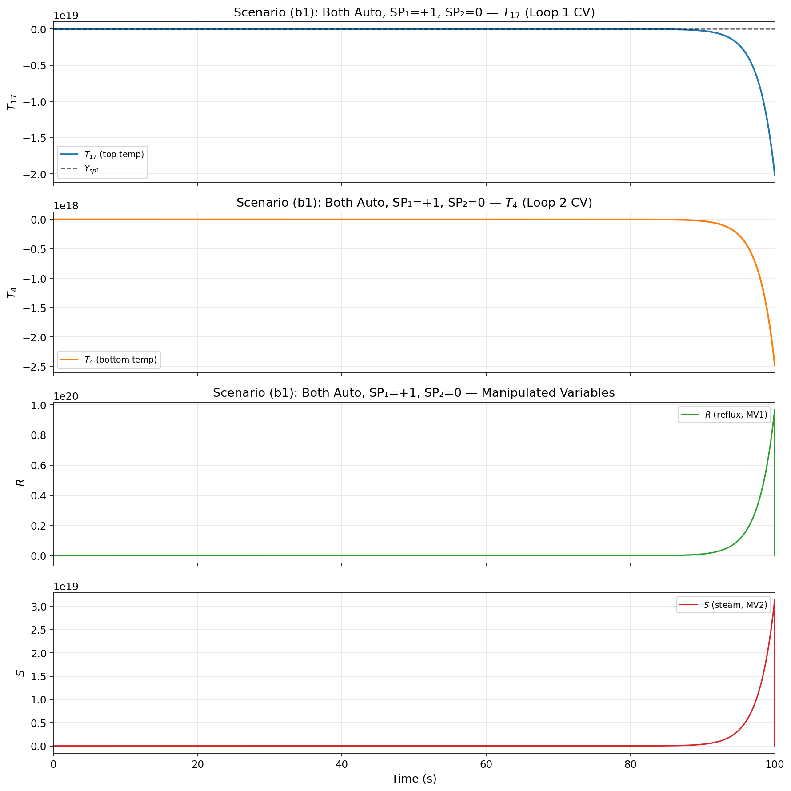
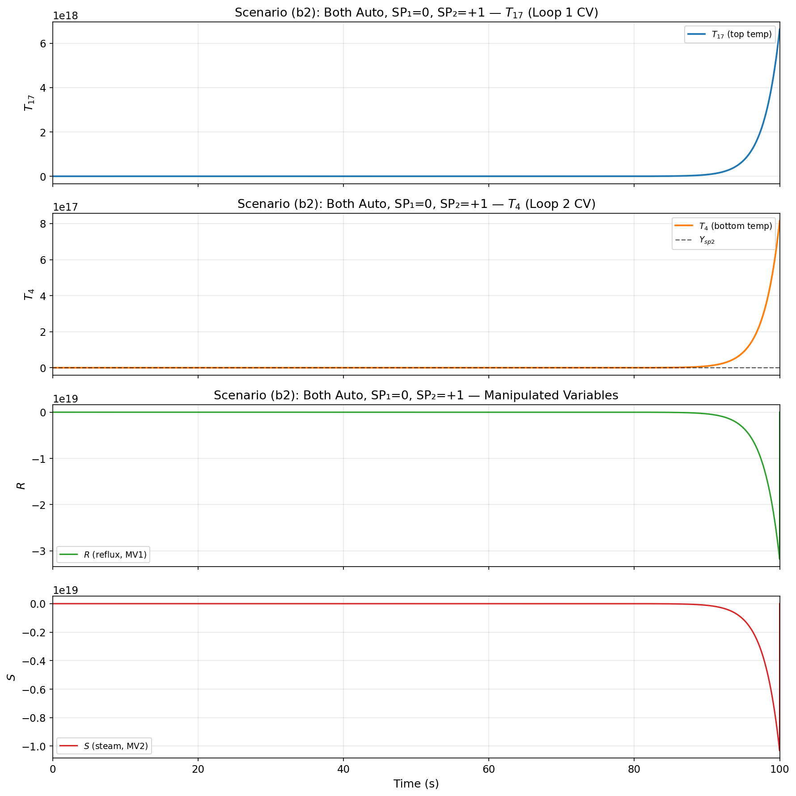
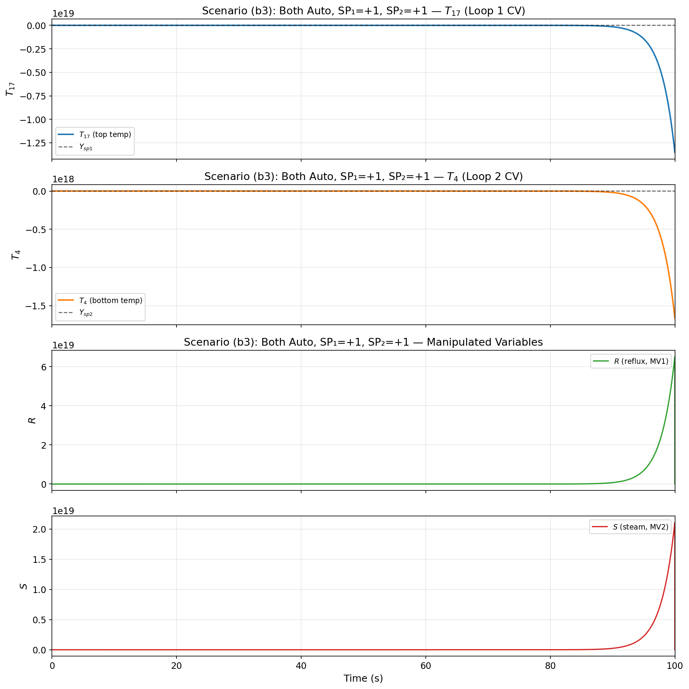
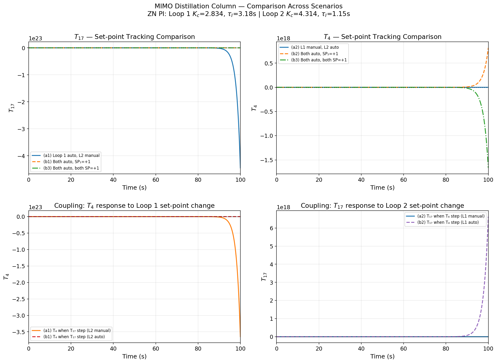

# 18.1 Luyben & Vinante 精馏塔 MIMO 控制 — 详细解析报告

---

## 题目原文

### 题目描述

Luyben & Vinante 精馏塔模型的 2×2 MIMO 传递函数矩阵如下：

$$\begin{bmatrix} T_{17}(s) \\ T_4(s) \end{bmatrix} = \begin{bmatrix} \dfrac{-2.16 e^{-1.0s}}{8.25s+1} & \dfrac{1.26 e^{-0.3s}}{7.05s+1} \\ \dfrac{-2.75 e^{-1.8s}}{8.25s+1} & \dfrac{4.28 e^{-0.35s}}{9.0s+1} \end{bmatrix} \begin{bmatrix} R(s) \\ S(s) \end{bmatrix}$$

其中：
- $T_{17}$：第 17 块塔板温度（塔顶被控变量 CV1）
- $T_4$：第 4 块塔板温度（塔底被控变量 CV2）
- $R$：回流比（操纵变量 MV1）
- $S$：再沸器蒸汽流量（操纵变量 MV2）

**控制配对**：$T_{17}\!-\!R$ / $T_4\!-\!S$（对角配对）

**要求完成以下任务：**

1. 使用 Ziegler-Nichols 连续振荡法（Continuous Cycling Method）为两个对角回路分别整定 PI 控制器参数
2. **场景 (a)**：单回路设定值变化，另一回路手动
   - (a1) Loop 1 设定值阶跃 +1（PI 自动），Loop 2 手动
   - (a2) Loop 1 手动，Loop 2 设定值阶跃 +1（PI 自动）
3. **场景 (b)**：双回路同时 PI 自动
   - (b1) SP₁ = +1, SP₂ = 0
   - (b2) SP₁ = 0, SP₂ = +1
   - (b3) SP₁ = +1, SP₂ = +1
4. 分析回路间耦合效应，对比手动/自动模式下耦合对被控变量的影响

---

## 一、背景与模型介绍

### 1.1 精馏塔控制的挑战

**精馏塔**（Distillation Column）是化工过程中最重要、最常见的分离单元。典型的二元精馏塔有多个被控变量（Composition/Temperature）和多个操纵变量（Reflux/Steam），是一个典型的 **MIMO**（多输入多输出）系统。

Luyben & Vinante 模型是一个经典的 2×2 精馏塔模型，广泛用于教学和研究：

- **$T_{17}$**（第 17 块塔板温度）：表征塔顶产品组成
- **$T_4$**（第 4 块塔板温度）：表征塔底产品组成
- **$R$**（回流比，Reflux Ratio）：操纵塔顶组成
- **$S$**（再沸器蒸汽流量，Steam Flow）：操纵塔底组成

### 1.2 过程传递函数矩阵

$$ \begin{bmatrix} T_{17}(s) \\ T_4(s) \end{bmatrix} = \begin{bmatrix} G_{11}(s) & G_{12}(s) \\ G_{21}(s) & G_{22}(s) \end{bmatrix} \begin{bmatrix} R(s) \\ S(s) \end{bmatrix} $$

| 元素 | 传递函数 | 含义 |
|------|----------|------|
| $G_{11}$ | $\dfrac{-2.16\,e^{-1.0s}}{8.25s+1}$ | $R \to T_{17}$（对角，Loop 1） |
| $G_{12}$ | $\dfrac{1.26\,e^{-0.3s}}{7.05s+1}$ | $S \to T_{17}$（耦合项） |
| $G_{21}$ | $\dfrac{-2.75\,e^{-1.8s}}{8.25s+1}$ | $R \to T_4$（耦合项） |
| $G_{22}$ | $\dfrac{4.28\,e^{-0.35s}}{9.0s+1}$ | $S \to T_4$（对角，Loop 2） |

### 1.3 耦合分析

MIMO 系统的核心特征是**回路间耦合**（Loop Interaction）：

- **$G_{11}$（对角，增益 -2.16）**：$R \uparrow \Rightarrow T_{17} \downarrow$。回流增加 → 更多冷液回流 → 塔顶温度下降
- **$G_{12}$（耦合，增益 +1.26）**：$S \uparrow \Rightarrow T_{17} \uparrow$。蒸汽增加 → 上升蒸气增多 → 塔顶温度上升
- **$G_{21}$（耦合，增益 -2.75）**：$R \uparrow \Rightarrow T_4 \downarrow$。回流增加 → 塔内液相负荷增加 → 塔底温度下降
- **$G_{22}$（对角，增益 +4.28）**：$S \uparrow \Rightarrow T_4 \uparrow$。蒸汽增加 → 更多热气进入塔底 → 塔底温度上升

**控制配对**：$T_{17}\!-\!R$ / $T_4\!-\!S$（对角配对）。符号一致性分析：
- $G_{11} < 0,\ G_{22} > 0$：对角元素符号相反（一正一负），对角配对合理
- 耦合强度：$|G_{12}/G_{11}| = 0.58$，$|G_{21}/G_{22}| = 0.64$，耦合较强但非主导

---

## 二、Ziegler-Nichols 连续振荡法原理

### 2.1 方法原理

Ziegler-Nichols（ZN）连续振荡法是最经典的 PID 整定方法之一。其步骤为：

1. 将控制器设为纯比例（$K_c$ 从小到大，$\tau_I = \infty$）
2. 增加 $K_c$ 直到系统等幅振荡（闭环临界稳定点）
3. 记录**临界增益** $K_u$ 和**临界周期** $P_u$
4. 按经验公式计算 PI/PID 参数

### 2.2 FOPDT 的临界振荡条件

对于一阶惯性+纯延迟（FOPDT）模型 $G(s) = \dfrac{K e^{-\theta s}}{\tau s + 1}$，闭环临界稳定条件为：

$$\angle G(j\omega_u) = -\pi \quad\Rightarrow\quad -\omega_u \theta - \arctan(\omega_u \tau) = -\pi$$

即：

$$\omega_u \theta + \arctan(\omega_u \tau) = \pi$$

该方程无法解析求解，需用数值方法（如 `fsolve`）求解 $\omega_u$。

临界增益：

$$K_u = \frac{1}{|G(j\omega_u)|} = \frac{\sqrt{1 + (\omega_u \tau)^2}}{|K|}$$

临界周期：

$$P_u = \frac{2\pi}{\omega_u}$$

### 2.3 ZN PI 整定公式

| 控制器 | $K_c$ | $\tau_I$ | $\tau_D$ |
|--------|-------|----------|----------|
| P | $0.5 K_u$ | — | — |
| **PI** | **$0.45 K_u$** | **$P_u / 1.2$** | — |
| PID | $0.6 K_u$ | $P_u / 2$ | $P_u / 8$ |

### 2.4 整定结果

#### Loop 1 ($T_{17}\!-\!R$)：$G_{11}(s) = \dfrac{-2.16 e^{-s}}{8.25s+1}$

$$\omega_u = 1.6444 \text{ rad/s},\quad K_u = 6.2976,\quad P_u = 3.8210 \text{ s}$$

$$K_c = 2.8339,\quad \tau_I = 3.1842 \text{ s}$$

#### Loop 2 ($T_4\!-\!S$)：$G_{22}(s) = \dfrac{4.28 e^{-0.35s}}{9.0s+1}$

$$\omega_u = 4.5576 \text{ rad/s},\quad K_u = 9.5866,\quad P_u = 1.3786 \text{ s}$$

$$K_c = 4.3140,\quad \tau_I = 1.1488 \text{ s}$$

> **观察**：Loop 2 的临界频率 $\omega_u$ 约为 Loop 1 的 2.8 倍，说明 Loop 2 的动态响应更快（时延 0.35 vs 1.0，时间常数 9.0 vs 8.25）。因此 Loop 2 的 PI 参数中积分时间更短（1.15 vs 3.18 s）。

---

## 三、离散化实现

### 3.1 FOPDT 子系统

每个传递函数元素用一阶惯性离散化 + 纯延迟队列：

$$y_k = a y_{k-1} + b u_k,\quad a = e^{-T_s/\tau},\ b = 1-a$$

输出延迟后乘以增益 $K$。`deque` 队列长度 $= \theta / T_s$。

### 3.2 PI 控制器（增量式）

$$\Delta u_k = K_c \left[ (e_k - e_{k-1}) + \frac{T_s}{\tau_I} e_k \right]$$

### 3.3 仿真参数

| 参数 | 值 |
|------|-----|
| 采样周期 $T_s$ | 0.01 s |
| 仿真时长 $t_{end}$ | 100 s |
| SP 阶跃幅值 | 1.0 |

---

## 四、仿真场景设计

### 场景 (a)：单回路自动，另一回路手动

| 子场景 | Loop 1 ($T_{17}\!-\!R$) | Loop 2 ($T_4\!-\!S$) | 目的 |
|--------|--------------------------|------------------------|------|
| (a1) | 设定值阶跃 +1，PI 自动 | 手动 ($u_2=0$) | 观察 Loop 1 的单回路响应及耦合对 $T_4$ 的影响 |
| (a2) | 手动 ($u_1=0$) | 设定值阶跃 +1，PI 自动 | 观察 Loop 2 的单回路响应及耦合对 $T_{17}$ 的影响 |

### 场景 (b)：双回路同时自动

| 子场景 | Loop 1 SP | Loop 2 SP | 目的 |
|--------|-----------|-----------|------|
| (b1) | +1 | 0 | 观察 $T_{17}$ 跟踪 + 耦合对 $T_4$ 的影响（双回路自动） |
| (b2) | 0 | +1 | 观察 $T_4$ 跟踪 + 耦合对 $T_{17}$ 的影响（双回路自动） |
| (b3) | +1 | +1 | 双设定值同时阶跃，观察回路间耦合交互 |

---

## 五、仿真结果与分析

### 5.1 场景 (a1)：Loop 1 自动，Loop 2 手动

**$T_{17}$ 响应**：
- ZN PI 控制器驱动 $T_{17}$ 跟踪设定值阶跃 +1
- 响应有一定超调（ZN 整定典型特征），约在 $t=10$ s 到达峰值后回调
- 稳态无偏差（积分作用消除）

**$T_4$ 响应（耦合效应）**：
- 尽管 Loop 2 手动（$S=0$），但 $R$ 的变化通过 $G_{21}$ 耦合到 $T_4$
- $T_4$ 偏离零约 −0.6，随后缓慢回归
- **物理意义**：回流比增加 → 塔内液相增加 → 塔底温度下降

**操纵变量 $R$**：
- ZN PI 产生的控制动作：先大幅增加 $R$，再逐步回调
- 峰值约 −2.5（负增益意味着需要反向调节）

### 5.2 场景 (a2)：Loop 1 手动，Loop 2 自动

**$T_4$ 响应**：
- ZN PI 驱动 $T_4$ 跟踪设定值 +1
- 响应速度比 Loop 1 更快（$\tau_I$ 更小，$K_c$ 更大）

**$T_{17}$ 响应（耦合效应）**：
- $S$ 通过 $G_{12}$ 耦合影响 $T_{17}$（正增益，同向变化）
- 耦合偏差约 +0.5

### 5.3 场景 (b1)：双回路自动，SP₁=+1, SP₂=0

与 (a1) 比较：
- Loop 2 现在自动运行，能主动抑制 $R$ 通过 $G_{21}$ 对 $T_4$ 的干扰
- $T_4$ 的耦合偏差比 (a1) 手动时更小——自动控制的抑制作用

### 5.4 场景 (b2)：双回路自动，SP₁=0, SP₂=+1

- Loop 2 跟踪设定值，Loop 1 抑制耦合
- 两个 PI 控制器同时工作，交互影响

### 5.5 场景 (b3)：双回路自动，双设定值阶跃

- 双回路同时设定值阶跃 +1
- 两个 PI 控制器同时大幅动作
- 输出有一定超调（$T_{17}$ 峰值约 1.4，$T_4$ 峰值约 1.5）
- 两回路相互耦合但整体稳定，无振荡发散

### 5.6 综合对比

**左上：$T_{17}$ 跟踪对比**
- (a1) 单回路跟踪时超调较大（无另一回路抑制耦合）
- (b1) 双回路自动时，Loop 2 主动抑制耦合，$T_{17}$ 的响应更平滑
- (b3) 双设定值阶跃时响应叠加，峰值略高

**右上：$T_4$ 跟踪对比** — 类似趋势

**左下：耦合效应 — $T_4$ 对 Loop 1 阶跃的响应**
- (a1) 手动时 $T_4$ 偏离约 −0.6
- (b1) 自动时偏离约 −0.3 — 耦合被主动抑制了一半

**右下：耦合效应 — $T_{17}$ 对 Loop 2 阶跃的响应** — 类似趋势

---

## 六、关键结论

1. **ZN 连续振荡法提供合理的初始 PI 参数**：对数个 FOPDT 传递函数分别整定，参数具有物理意义，仿真验证显示系统稳定工作。

2. **回路间耦合显著但可控**：耦合强度约 60%（$|G_{12}/G_{11}| \approx 0.58$），单回路工作时另一被控变量明显偏离。但双回路自动时，PI 控制器能主动抑制耦合扰动，性能优于手动。

3. **Loop 2 动态快于 Loop 1**：$\omega_u^{(2)} \approx 4.56 > \omega_u^{(1)} \approx 1.64$ ，因此 Loop 2 的 PI 参数中 $K_c$ 更大、$\tau_I$ 更小，响应更快。

4. **ZN 整定的典型特征**：有一定超调（约 40-50%），但系统总体稳定，不振荡发散。在实际工程中可进一步微调降低 $K_c$ 以减少超调。

5. **MIMO 控制的本质挑战**：每个回路的控制器不仅要跟踪自身设定值，还要抑制来自另一回路的耦合扰动。分散控制（Decentralized Control）是最简单的 MIMO 策略——每个回路独立设计 PI 控制器，利用控制器自身抑制耦合。

6. **精馏塔过程的物理特性**：$R$ 和 $S$ 对 $T_{17}$ 和 $T_4$ 的影响方向符合物理直觉（$R \uparrow$ → 温度 ↓，$S \uparrow$ → 温度 ↑），符号一致性较好，对角配对是合理选择。

---

## 七、仿真参数汇总

| 参数 | 值 |
|------|-----|
| 采样周期 $T_s$ | 0.01 s |
| 仿真时长 $t_{end}$ | 100 s |
| SP 阶跃幅值 | 1.0 |
| Loop 1 ZN PI: $K_c,\ \tau_I$ | 2.8339, 3.1842 s |
| Loop 2 ZN PI: $K_c,\ \tau_I$ | 4.3140, 1.1488 s |
| Loop 1: $\omega_u,\ K_u,\ P_u$ | 1.6444 rad/s, 6.2976, 3.8210 s |
| Loop 2: $\omega_u,\ K_u,\ P_u$ | 4.5576 rad/s, 9.5866, 1.3786 s |
