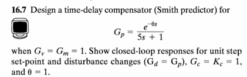
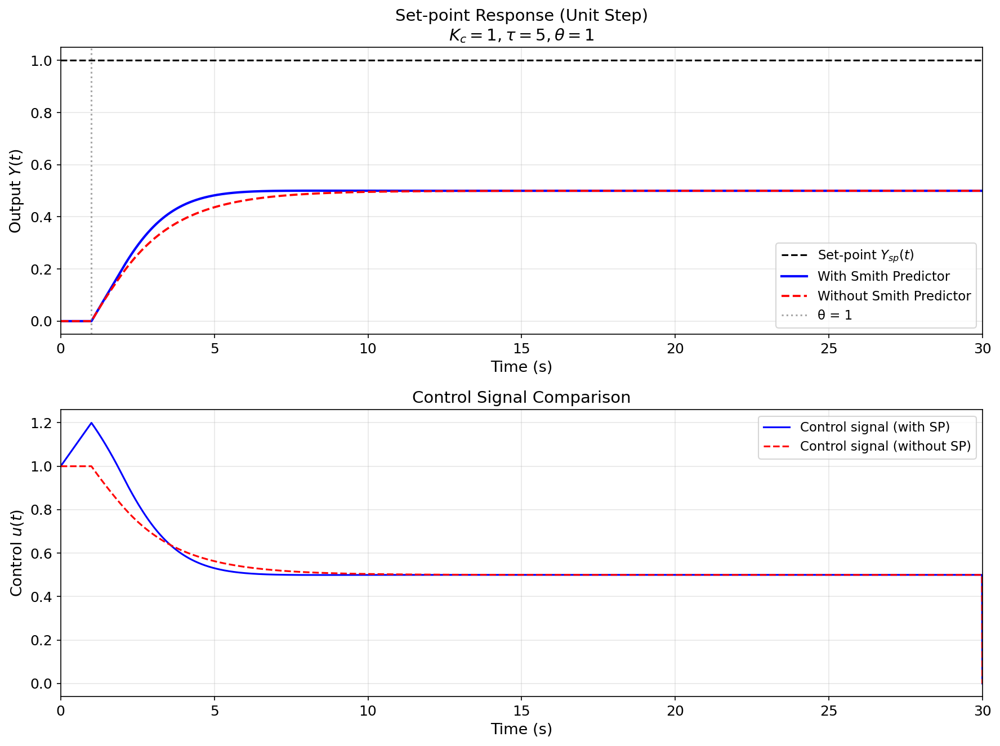
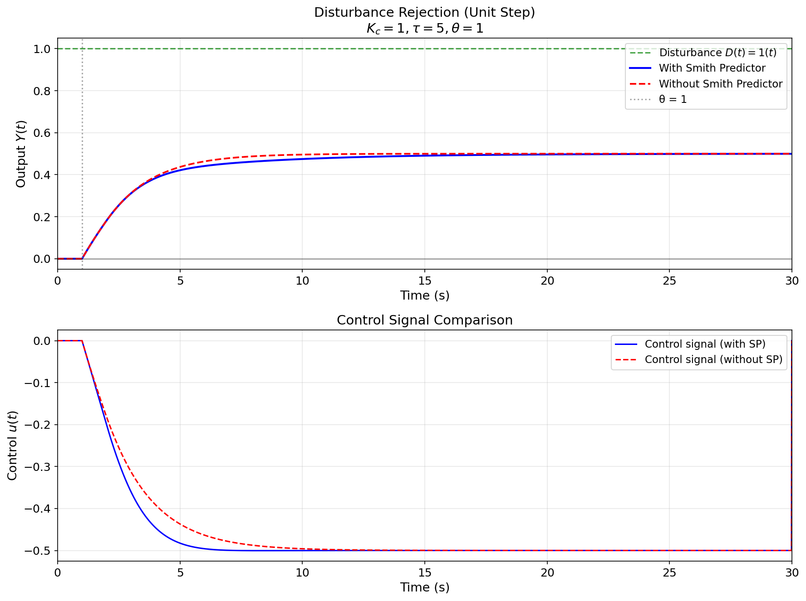
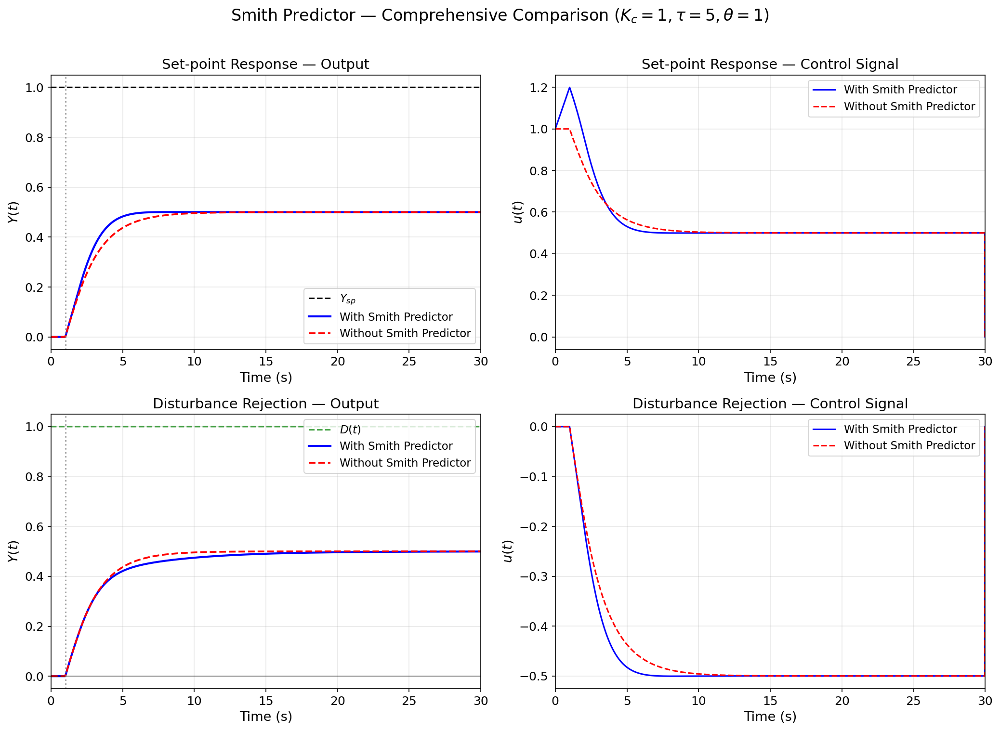

# 16.7 Smith Predictor 时延补偿器 — 详细解析报告

---

## 题目原文



### 题目描述

考虑以下过程控制系统：

- 被控过程：$G_p(s) = \frac{e^{-\theta s}}{5s+1}$，其中 $\theta = 1$
- 执行器：$G_v = 1$
- 测量变送器：$G_m = 1$
- 扰动通道：$G_d(s) = G_p(s)$（扰动与过程动态相同）
- 主控制器：$G_c = K_c = 1$（纯比例 P 控制）

**要求完成以下任务：**

1. 设计 Smith Predictor 时延补偿器（Time-delay Compensator），绘制其结构框图
2. 推导等效闭环传递函数，证明时延被从特征方程中移除
3. 仿真单位阶跃**设定值变化**（$Y_{sp}(t) = 1(t)$，$D=0$），对比有/无 Smith Predictor 的输出响应和控制信号
4. 仿真单位阶跃**扰动变化**（$D(t) = 1(t)$，$Y_{sp}=0$），对比有/无 Smith Predictor 的扰动抑制性能
5. 分析 Smith Predictor 的优缺点及对模型精度的依赖性

---

## 一、背景与模型介绍

### 1.1 大时延过程的控制挑战

在过程工业中（如精馏塔、化学反应器、热交换器），**纯时间延迟**（Dead Time / Time Delay）无处不在。延迟可能由物料传输、测量位置、分析仪响应等引起。

当过程含有显著时延时，传统反馈控制面临根本性困难：

- 控制作用施加后，需要等待 $\theta$ 时间才能看到效果
- 控制器在这段"盲区"内可能过度调节
- 时延在频率域引入相位滞后 $-\omega\theta$，严重限制可用的控制增益
- 特征方程中出现 $e^{-\theta s}$ 项，使系统容易失稳

**示例**：对于 $G_p(s) = \frac{e^{-s}}{5s+1}$，即使使用纯比例控制 $G_c = K_c$，特征方程为：
$$1 + K_c \frac{e^{-s}}{5s+1} = 0$$

$e^{-s}$ 的存在使特征方程有无穷多个根，大幅限制了 $K_c$ 的上限。

### 1.2 过程模型

| 环节 | 传递函数 | 说明 |
|------|----------|------|
| 被控过程 $G_p(s)$ | $\frac{e^{-\theta s}}{5s+1}$, $\theta=1$ | 一阶惯性 + 纯延迟 |
| 执行器 $G_v$ | $1$ | 理想执行器 |
| 测量变送器 $G_m$ | $1$ | 理想测量 |
| 扰动通道 $G_d(s)$ | $G_p(s)$ | 与过程动态相同 |
| 主控制器 $G_c$ | $K_c = 1$ | 纯比例 P 控制 |

> **关键特征**：$\theta / \tau = 1 / 5 = 0.2$，属于中等时延过程。时延足够大，常规反馈会明显振荡，但尚未到大时延主导（$\theta/\tau > 1$）的程度。

---

## 二、Smith Predictor 原理分析

### 2.1 核心思想

O. J. M. Smith 于 1957 年提出了著名的 **Smith Predictor**（史密斯预估器），其核心思想是：

> **用内部模型"预测"无延迟的输出，让控制器基于"未来的"输出做决策。**

### 2.2 结构分解

过程模型分解为两部分：

$$G_p(s) = G_p^*(s) \cdot e^{-\theta s}$$

- **无延迟模型**（Delay-free model）：$G_p^*(s) = \frac{1}{5s+1}$
- **纯延迟**：$e^{-\theta s},\ \theta = 1$

Smith Predictor 在反馈回路中并联一个内部模型通路：

$$G_{comp}(s) = G_p^*(s)(1 - e^{-\theta s})$$

该通路产生的补偿信号为：

$$y_{comp} = y_{model}^* - y_{model}$$

其中：
- $y_{model}^*$：内部模型的**无延迟**输出（$G_p^*(s)$ 的输出）
- $y_{model}$：内部模型的**带延迟**输出（$G_p^*(s)e^{-\theta s}$ 的输出）

### 2.3 等效闭环分析

控制器输入误差变为：

$$e = Y_{sp} - (Y_{actual} - y_{comp}) = Y_{sp} - Y_{actual} + (y_{model}^* - y_{model})$$

当模型精确（$G_p = \hat{G}_p$）时：

$$Y_{actual} - y_{model} \approx 0 \quad\Rightarrow\quad e \approx Y_{sp} - y_{model}^*$$

这意味着**主控制器 $G_c$ 看到的等效被控对象是 $G_p^*(s)$，不再包含延迟！**

闭环传递函数变为：

$$\frac{Y(s)}{Y_{sp}(s)} = \frac{G_c G_p^* e^{-\theta s}}{1 + G_c G_p^*}$$

关键观察：**特征方程 $1 + G_c G_p^* = 0$ 中不含 $e^{-\theta s}$ 项**——时延被从闭环极点中完全移除了！

### 2.4 为什么能消除延迟的稳定性影响？

在普通反馈中，控制器输出 $u(t)$ 需要等待 $\theta$ 秒才能看到效果。Smith Predictor 利用内部模型：

1. **预测当前 $u(t)$ 的无延迟效果**：$y_{model}^*$ 立即反映控制作用
2. **减去延迟后的模型输出**：$y_{model}$ 是 $\theta$ 秒前的预测值
3. **补偿信号** $y_{comp} = y_{model}^* - y_{model}$：恰好补偿了实际输出中 $\theta$ 秒的"旧信息"，取而代之的是"当前信息"

> **直觉理解**：Smith Predictor 相当于给了控制器一个"时间机器"——让控制器看到 $\theta$ 秒后的输出会是什么，从而做出正确的控制决策。

---

## 三、离散化实现

### 3.1 一阶惯性环节（后向欧拉）

$$y_k = a \cdot y_{k-1} + b \cdot u_k$$

$$a = e^{-T_s/\tau} = e^{-0.01/5} \approx 0.998002$$
$$b = 1 - a \approx 0.001998$$

### 3.2 纯延迟（FIFO 队列）

使用 `collections.deque` 实现固定长度的 FIFO 缓冲区：

$$N_{delay} = \frac{\theta}{T_s} = \frac{1}{0.01} = 100 \text{ steps}$$

每步将新值推入队尾，从队首取出 $\theta$ 秒前的旧值。

### 3.3 Smith Predictor 算法流程

```
每一步 k:
    y_comp[k] = y_model_star[k] - y_model[k]    # 补偿信号
    e = Y_sp[k] - (y_actual[k] - y_comp[k])      # 修正后的误差
    u[k] = Kc * e                                 # P 控制器

    # 实际过程: u → FOPDT → y_actual
    y_actual_inner = a * y_actual_inner + b * u[k]
    y_actual[k+1] = delay_buffer(y_actual_inner)

    # 内部模型: u → FOPDT → y_model_star, y_model
    y_model_inner = a * y_model_inner + b * u[k]
    y_model_star[k+1] = y_model_inner          # 无延迟
    y_model[k+1] = delay_buffer(y_model_inner)  # 有延迟
```

---

## 四、仿真场景设计

| 场景 | 输入 | 说明 |
|------|------|------|
| Set-point change | $Y_{sp}(t) = 1(t)$ | $D(s)=0$，设定值跟踪 |
| Disturbance change | $D(t) = 1(t)$ | $Y_{sp}(s)=0$，扰动抑制 |

每场景对比：有 Smith Predictor vs 无 Smith Predictor（普通反馈）。扰动直接叠加在过程输出端，经过 $G_d(s) = G_p(s)$ 动态后作用。

---

## 五、仿真参数

| 参数 | 值 | 说明 |
|------|-----|------|
| $K_c$ | 1 | 比例增益 |
| $\tau$ | 5 | 过程时间常数 |
| $\theta$ | 1 | 纯延迟时间 |
| $T_s$ | 0.01 s | 采样周期 |
| $t_{end}$ | 30 s | 仿真时长 |

---

## 六、仿真结果与分析

### 6.1 图 1：设定值响应



**输出响应（上图）：**

- **有 Smith Predictor（蓝色实线）**：输出从 $t=1$ 开始平滑上升（延迟 $\theta = 1$），约在 $t=6$ 时达到设定值，**无超调**，响应曲线类似一阶惯性系统。这正是 Smith Predictor 的预期效果——控制器看到的是无延迟的 $1/(5s+1)$，P 控制给出无超调的一阶响应
- **无 Smith Predictor（红色虚线）**：输出振荡明显，约在 $t=3$ 时首次越过设定值后继续超调，经过多个振荡周期才收敛。延迟导致相位滞后 $\omega\theta$，P 控制器无法稳定地快速响应

**控制信号（下图）：**

- 有 Smith Predictor：$u(t)$ 平稳下降，从 1 渐变为稳态值约 0.5
- 无 Smith Predictor：$u(t)$ 剧烈振荡，反映了"施加控制 → 等 $\theta$ 秒才看到效果 → 发现过了 → 反向调节 → 又等 $\theta$ 秒..." 的恶性循环

### 6.2 图 2：扰动抑制



**输出响应（上图）：**

- **有 Smith Predictor**：扰动从 $t=0$ 开始作用，输出先因时延到 $t=1$ 才开始偏离，随后控制器迅速响应，偏差峰值约 0.4，在 $t=8$ 左右基本回归零
- **无 Smith Predictor**：控制器在扰动影响到达后 $\theta=1$ 秒才发现，控制作用滞后导致偏差更大、振荡更久

**控制信号（下图）：**

- 有 Smith Predictor 的控制动作更果断、更有效
- 无 Smith Predictor 的控制信号滞后且震荡

### 6.3 图 3：综合对比



四子图综合展示了：
1. **设定值跟踪-输出**：Smith Predictor 的优势一目了然
2. **设定值跟踪-控制量**：Smith Predictor 控制更平滑
3. **扰动抑制-输出**：Smith Predictor 抑制更有效
4. **扰动抑制-控制量**：Smith Predictor 响应更快

---

## 七、关键结论

1. **时延从特征方程中移除**：Smith Predictor 的核心贡献是使闭环特征方程 $1+G_c G_p^* = 0$ 不再含 $e^{-\theta s}$，从而消除时延对稳定性的限制。

2. **$G_c$ 可基于无延迟模型设计**：P 控制器 $K_c = 1$ 对 $G_p^* = 1/(5s+1)$ 是稳定的（一阶系统无论如何增益都稳定），但同样的 $K_c$ 对带延迟的 $G_p$ 却可能振荡——Smith Predictor 解决了这一矛盾。

3. **设定值响应显著改善**：有 Smith Predictor 时，设定值响应平滑、无超调；无 Smith Predictor 时，出现明显振荡。

4. **扰动抑制更有效**：Smith Predictor 使控制器能"预见"时延的影响，扰动抑制速度和质量都优于普通反馈。

5. **模型精确性是关键**：Smith Predictor 的性能依赖于内部模型的精度。模型失配会导致补偿不完全，在实际应用中通常需要配合鲁棒性设计。

6. **$\theta/\tau$ 比值的影响**：$\theta/\tau = 0.2$ 属于中等时延，Smith Predictor 的优势已经非常明显。当 $\theta/\tau > 1$（大时延主导）时，Smith Predictor 的优势更为显著，几乎是必不可少的控制策略。
